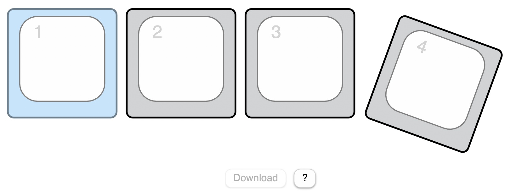

# Introduction

PicoSplit is a DIY 3D-printed split keyboard that uses two Raspberry Pi Pico controllers with a CircuitPython based firmware. **This repository contains the firmware.** You can find the building instructions for the hardware and the 3D files on my homepage: [PicoSplit Home](https://kaenner.de/picosplit).


# PicoSplit keyboard

- Fully 3D-printable with common FDM printers.
- [Dactyl keyboard](https://github.com/adereth/dactyl-keyboard) inspired shape.
- Allows for a natural and relaxed hand position even after hours of typing.
- Interchangeable wrist rests that magnetically dock to the keyboard.
- The distance between keyboard and wrist rests is adjustable.
- Keyboard and wrist rests can be magnetically attached to a surface.
- Switches are interchangeable.
- A layout that reduces finger travel a lot is already included. It is inspired by the [Miryoku layout](https://github.com/manna-harbour/miryoku/tree/master/docs/reference).


# PicoSplit firmware

I originally developed this firmware to try out the [Miryoku layout](https://github.com/manna-harbour/miryoku/tree/master/docs/reference) without having to install its development environment with several hundred megabytes. The PicoSplit firmware certainly has fewer features than some other firmware, but it comes with everything for configuration. You don't need to install additional software on your computer. A simple text editor and a web browser is all you need. Since the firmware can also be used to create other keyboards, I provide it here for free under the **MIT license**. 

## Firmware features

- Time-saving system for wiring the switches without having to use diodes.
- No need to install any other software on your computer. 
- Advanced keyboard layouts like the [Miryoku layout](https://github.com/manna-harbour/miryoku/tree/master/docs/reference) are possible.
- Readable configuration file format.
- Easily modifiable with some Python knowledge.
- Can be used to create your own (split or non split) keyboard from scratch.

## Limitations

The PicoSplit firmware is based on CircuitPython. Currently USB keyboards created with CircuitPython do not work in all situations. For example: On my Intel iMac (macOS 11.x), I can not enter the login password if the hard disk is encrypted and waking up that Mac from sleep by pressing a key on the PicoSplit does not work (see [discussion](https://github.com/adafruit/circuitpython/issues/1136#issuecomment-942177135)).

On the other hand, I can use the PicoSplit with a M1 MacBook without problems. So it depends. There are fewer problems on Windows and Linux, and the keyboard works with my iOS and Android devices too.

## Circuit diagram

The PicoSplit consists of two halves, each equipped with a Raspberry Pi Pico. Both halves communicate with each other via a serial interface. They are connected with a TRRS cable for this purpose. Only one of the two halves has to be connected to the computer with a USB cable (the master keyboard).

This is the circuit diagram for the PicoSplit, with a total of 40 switches. 


The wiring is the same for both halves except for the send and receive lines of the serial port. The half that connects to the computer gets a different firmware, but you can decide which half that should be. The master keyboard is the one which is connected to the computer. The other half is the slave keyboard. 

Here you can see how the TRRS jacks are wired to the controllers in the [PicoSplit keyboard](http://kaenner.de/picosplit.html):


## Changing the number of keys

If you want to build a different keyboard than the PicoSplit keyboard, you may want to change the number of keys. You can do that for the master keyboard in the file **Master/main.py**. Add or remove pins from the tuple which is passed as the second parameter to SplitKeypad.

```
kb = loader.keyboard(SplitKeypad(20, 
						(board.GP2,
						 board.GP3,
						 board.GP4,
						 board.GP5,
						 board.GP6,
						 board.GP7,
						 board.GP8,
						 board.GP9,
						 board.GP10,
						 board.GP11,
						 board.GP12,
						 board.GP13,
						 board.GP14,
						 board.GP15,
						 board.GP16,
						 board.GP17,
						 board.GP18,
						 board.GP19,
						 board.GP20,
						 board.GP21)))
```

Change `self.key_pins` in **Slave/main.py** if you want to adjust the number of keys or the pins used in the slave keyboard. 
```
 self.key_pins = (board.GP2,
                  board.GP3,
                  board.GP4,
                  board.GP5,
                  board.GP6,
                  board.GP7,
                  board.GP8,
                  board.GP9,
                  board.GP10,
                  board.GP11,
                  board.GP12,
                  board.GP13,
                  board.GP14,
                  board.GP15,
                  board.GP16,
                  board.GP17,
                  board.GP18,
                  board.GP19,
                  board.GP20,
                  board.GP21)
```

To keep things simple, communication between the slave- and the master keyboard runs in one direction only. The slave keyboard sends its state to the master keyboard. But it does not send its number of keys. This would be a future extension. So at the moment you also have to change the first parameter to SplitKeypad in **Master/main.py**. Replace the 20 with the number of keys in the slave keyboard. If you set this value to zero, no slave keyboard is used.

```
kb = loader.keyboard(SplitKeypad( 20, ...
```

## Installing the firmware

The PicoSplit-Firmware is based on CircuitPython version 7.1. Previous versions do not work. Go to [https://circuitpython.org/board/raspberry_pi_pico/](https://circuitpython.org/board/raspberry_pi_pico/) and install CircuitPython on both keyboard halves. Then proceed with the next steps.

### Slave 

1. Connect the slave keyboard to your computer. 
2. A USB drive with the name CIRCUITPY appears inside the Finder (macOS) or Explorer (Windows).
3. Copy the files and folders inside the Slave folder of this repository to that drive.
4. Disconnect the slave keyboard.

### Master

1. Connect the master keyboard to your computer. 
2. A USB drive with the name CIRCUITPY appears inside the Finder (macOS) or Explorer (Windows).
3. Copy the files and folders inside the Master folder of this repository to that drive.

### Quick function test

1. Keep the master keyboard connected to the computer and connect the slave keyboard to the master keyboard with a TRRS cable.
2. Open an text editor
3. Press all the keys on your keyboard one after the other. 

Each time you press a key, a number should appear in the text editor and then the cursor should jump to the next line. **If no number appears when you press a key, check the wiring of the corresponding key.**

## Keyboard layout

When we talk about a keyboard layout, we often mean two things: The arrangement of keys on a keyboard and the key assignment. **In the PicoSplit firmware the layout term is used for the key assignment.**

The PicoSplit firmware is designed to make the wiring of the keyboard as simple as possible. For example: the keys don't have to be connected to specific pins of the microcontroller in order to match a certain key arrangement. This makes it easier to build handwired keyboards, because you can connect any key to any pin, as long as you use the pins you specified in the firmware.

The numbers you see when doing the quick function test are hardware key numbers. These hardware key numbers are mapped to standardized key numbers, which are used in the keyboard layout definition file (**layout.js**). This way you can use the same layout with differently wired keyboards. 

The mapping from hardware key numbers to layout key numbers cannot be done automatically, because the system does not know how the keys are wired. But there is a tool for this task. Open the file **PinMapper.html** in a web browser and you will see the following page:


These are all the keys on the PicoSplit keyboard. The small number in the top left corner is the key number which is used inside the layout definition file (**layout.js**). To map the hardware key numbers to those numbers, press the key on your keyboard that is highlighted in blue. 


The recorded hardware key number is now visible at the center of the key (**25**). Then the next key is highlighted. Continue until you have pressed all the keys. You can always select a key with the mouse to change incorrect entries. When you have pressed all the keys, click the *Download* button. This will save a **mapping.js** file in your downloads folder. Copy this file to your keyboard. 

If a **mapping.js** file is availabe on the keyboard, the keyboard stops emitting hardware key numbers and instead emits the key codes defined by the rules in **layout.js**.

### Creating an own key arrangement

The key arrangement is not hard coded. You can change it by modifying the file **keypositions.js**. A line in this file starts with the layout key number followed by the position and the rotation of the key. 

```
<key number>, <x coordinate in mm>, <y coordinate in mm>, <rotation in degree>
```

For example: A **keypositions.js** file for a simple macro keyboard with only four switches could look like this:

```
var keypositions = `
1,0.0,0.0,0.0
2,20.0,0.0,0.0
3,40.0,0.0,0.0
4,62.5,-3.5,20.0
`
```

The PinMapper.html file then shows these keys:



### Layout definition file

The keyboard layout is defined in **layout.js**. If you wonder why these and other files have the extension **.js**: They can be loaded as Javascript into a locally opened HTML page. For example: **PinMapper.html** uses this mechanism to read the key positions from **keypositions.js**. There is actually no HTML based tool for managing **layout.js**, but maybe there will be one in the future. 

#### Sections 

**layout.js** consists of sections. Each section begins with a section keyword in one line and ends with the next empty line. These are the three available section types:

- keyboard  
- layout
- layer

The order and count is important. It starts with the keyboard section, followed by a layout section and finally one or more layer sections.

#### Keyboard section 

The keyboard section defines some timeouts which apply to all keys. 

```
keyboard
tap_timeout=0.15
long_tap_timeout=0.4
```
To describe these values, I would like to briefly discuss various action triggers. The PicoSplit firmware supports three triggers for each key:
- tap
- long_tap
- hold

A **tap action** is triggered when you press and release a key before `tap_timeout` (in seconds).

A **long tap action** is triggered when you press a key longer than `tap_timeout` but release it before `long_tap_timeout` (in seconds). In combination with the Shift action, which will be described later, you can type a capital letter, just by holding the key down a little longer. How cool is this?

A **hold action** is immediately triggered when you press a key. If you release the key before `long_tap_timeout` the hold action is released before a tap or long tap is triggered. If you press the key longer than `long_tap_timeout`, the hold action is released when you release the key. Its action does not affect a tap or long tap if it emits modifier keys or switches to another layer.

You are probably wondering what this is good for? With the hold action you can assign modifiers to keys which are normally used to type characters. The PicoSplit keyboard uses hold actions to put all modifiers on the home position keys. Hold actions are also used to activate some layers. 

#### Layout section 

The layout section has just one property, the name of the layout. Currently **layout.js** can have only one layout section.

```
layout
name=US macOS
```

#### Layer section 

A layer has a name. It contains rules for action triggers (`tap`, `long_tap` or `hold`). There must be at least one layer - the base layer - and you can define multiple additional layers. Only one layer can be active at any time. However, rules do not have to be defined for all keys on each layer. For keys without a rule, the rule from the base layer is used.

Here is an example with all three action triggers and all available actions:

```
layer
name=Base
 1 : tap=Codes[ Q ] : long_tap=Shift
 6 : tap=Codes[ A ] : long_tap=Shift : hold=Codes[ LEFT_GUI ]
17 : tap=ChangeLayer( Special )

layer
name=Special
18 : tap=ResetKeyboard
                
layer
name=Umlaut
 6 : tap=Sequence[Codes[ LEFT_ALT, U ]; Codes[ A ]] : long_tap=Sequence[Codes[ LEFT_ALT, U ]; Codes[ LEFT_SHIFT, A ]] : hold=Codes[ LEFT_GUI ]
```

A line which describes rules for a key starts with the key number followed by at least one rule. A rule consists of the action trigger name (`tap`, `long_tap` or `hold`) followed by the equal sign and the action. Rules are separated by colons.

##### Available actions:

**Codes[ < Keycode >, < Keycode >, … ]**
Emits the given key codes at the same time. See **Keycodes.html** for all available key codes.  

**Sequence[ < Action > ; < Action > ]**
Emits the given actions one after the other. Sequences are currently not nestable and are only tested with Code actions. Note: The separator between actions inside sequences is a semicolon.

**Shift**
Can be triggered by a `long_tap` and is only usefull if a `tap` action exists. It triggers the tap action and emits the key code for the shift key at the same time. This is used to emit capitalized letters on a long tap.

**ChangeLayer( < layer name > )**
Activates the layer with the given name as long as the trigger (`tap` or `hold`) is active. 

**ResetKeyboard**
Resets the keyboard. 

### PicoSplit layout

This is the default PicoSplit layout:


The layout is well thought out. I use it on a Mac with an English keyboard setting but you can also type umlauts with it. Although only a few keys are available, you can type all the usual characters. You even have two unassigned keys (16 and 39) at your disposal.

## Keyboard modes and boot behavior

The keyboard has two operating modes:
1. If the PicoSplit is not in maintenance mode, it is a single keyboard device. 
2. If it is in maintenance mode, it shows up as a keyboard and as a USB memory drive. 

The keyboard is automatically in maintenance mode if no **mapping.js** file is on the memory drive. You can manually enter maintenance mode by resetting or reconnecting the keyboard to the computer while holding down a key. With the default PicoSplit layout, you can press the *Special* layer key (number 17), then tap *Esc* (number 18) while still holding down the *Special* layer key.

If you want to always boot the keyboard in maintenance mode set maintenance_mode to True at the beginning of **boot.py**.

```
maintenance_mode = True
```


